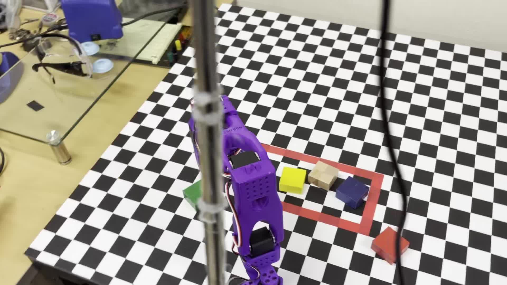
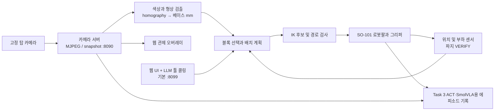
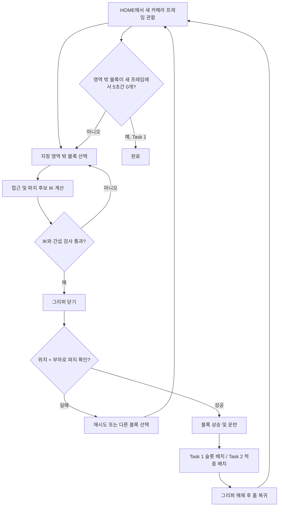
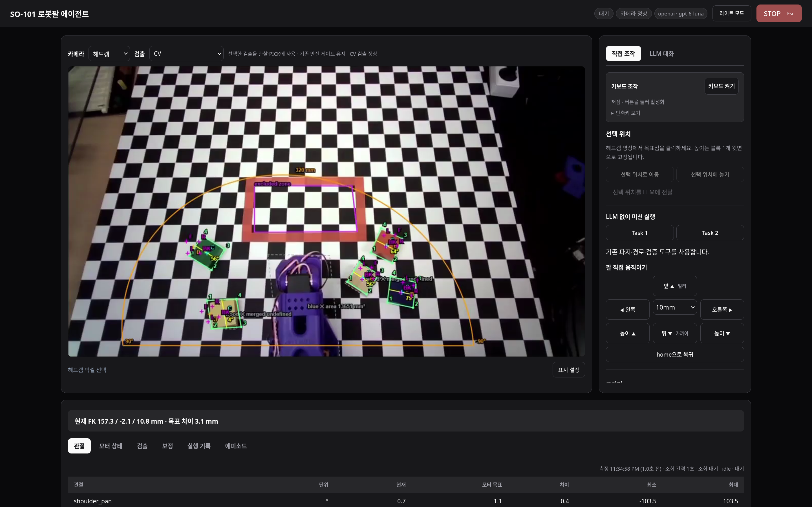
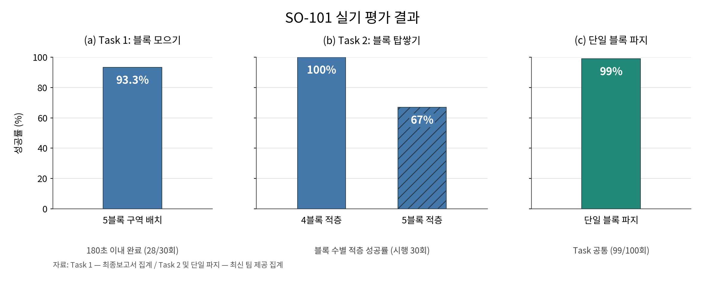
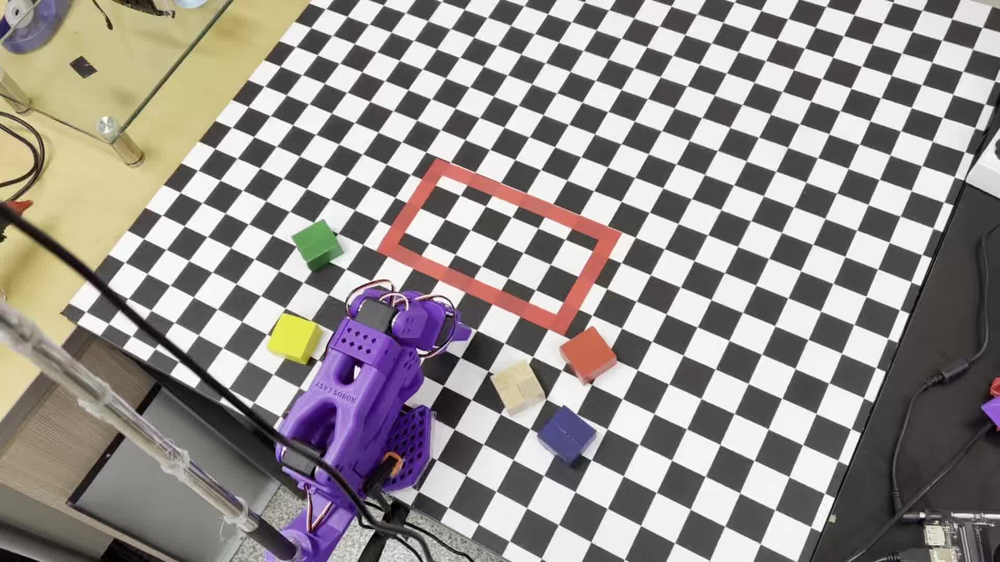
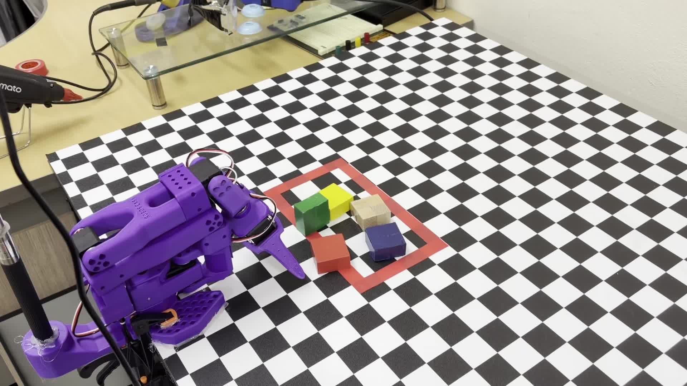

# Sim2Real: SO-101 Pick & Stack

<p align="center">
  
</p>

<p align="center">
  <a href="#5-설치-및-실행-방법"></a>
  <a href="docs/architecture.md"></a>
  <a href="docs/guide/web-agent.md"></a>
</p>

자연어 명령을 LLM 툴 콜링으로 해석하고, 고전 컴퓨터 비전(CV)과 역기구학(IK)으로 SO-101 로봇팔을 제어해 블록을 옮기고 쌓는 프로젝트입니다. 웹에서 색상별 블록 이동이나 체스판 칸 좌표 배치를 요청할 수 있습니다. Task 1/2 미션은 같은 CV+IK 제어 경로로 LLM 없이도 실행됩니다.

> **실기 평가** — 블록 모으기 완료율 **93.3%**, 5블록 적층 성공률 **67%**, 단일 블록 파지 성공률 **99%**. 웹 UI에서 자연어 명령과 로봇 상태 확인을 지원합니다.

[빠른 실행](#5-설치-및-실행-방법) / [아키텍처](docs/architecture.md) / [실험 기록](experiments/README.md) / [최종보고서](docs/report/최종보고서/final_report.pdf)

## 1. 프로젝트 배경

### 1.1. 국내외 시장 현황 및 문제점

국제로봇연맹(IFR)의 *World Robotics 2025*에 따르면 2024년 전 세계 산업용 로봇 신규 설치는 **542,076대**, 한국은 약 **30,600대**였습니다. 출처: [IFR 산업용 로봇 보고서](https://ifr.org/img/worldrobotics/Executive_Summary_WR_2025_Industrial_Robots.pdf), [IFR 국가별 발표](https://ifr.org/news/global-robot-demand-in-factories-doubles-over-10-years/1st-quarterly-newsletter-2010).

소형 로봇팔에서 단순한 `목표 픽셀 → 목표 관절` 연결만으로 안정적인 파지를 얻기는 어렵습니다. 카메라 위치 변화, 블록 윗면과 캘리브레이션 평면의 높이 차이, 실제 턱 중심과 URDF 기준 프레임의 차이, 팔의 처짐과 그리퍼 정렬 오차가 누적됩니다. 우리 팀의 초기 ACT와 SmolVLA 실험도 시작 위치와 카메라 조건이 바뀌면 데이터 재수집과 재학습 비용이 커지는 문제가 있었습니다. 이 문제 분석은 [CV+IK 전환 기록](docs/report/CV_IK_전환_정리.md)에 남겨 두었습니다.

### 1.2. 필요성과 기대효과

자연어 요청을 블록 선택과 배치 명령으로 바꾸고, 실제 로봇 동작은 **인식 → 접근 → 파지 확인 → 운반 → 배치 → 재관찰** 순서로 실행합니다. 단계별 결과를 확인해 실패 원인을 찾을 수 있으며, 성공한 동작은 ACT·SmolVLA 학습용 데이터셋으로 자동 기록할 수 있습니다.

## 2. 개발 목표

### 2.1. 목표 및 세부 내용

| 미션 | 목표 | 과제 제한 | 주요 기능 |
|---|---|---:|---|
| Task 1 | 무작위로 놓인 블록 5개를 20 × 10 cm 지정 영역에 배치 | 180초 | 고정 탑 카메라 CV + 동적 IK 슬롯, 파지 검증, 재시도, fresh frame 완료 판정 |
| Task 2 | 블록을 쌓고 5초 이상 유지 | 300초 | 공통 파지, 검증, 운반 흐름을 재사용하는 적층 제어 |
| Task 3 | ACT·SmolVLA용 시연 데이터 수집 자동화 | 별도 수집 기능 | 성공한 Task 1 사이클의 로봇 동작과 영상을 LeRobot 에피소드로 기록 |

웹의 LLM은 자연어 요청에 맞는 도구를 선택하고, CV+IK가 블록 검출과 좌표 변환, 파지·배치를 수행합니다. 도구로 실행한 동작도 도달성, 관절 제한, 파지 확인을 거칩니다. Task 1/2 자동 미션은 LLM 없이 실행할 수 있습니다.

### 2.2. 기존 서비스 대비 차별성

| 접근 | 장점 | 이 프로젝트에서 보완한 지점 |
|---|---|---|
| [LeRobot 기본 워크플로](https://huggingface.co/docs/lerobot/main/index) | SO-101 제어, 시연 기록, 정책 학습의 공통 기반 | 대회 규격의 영역 판정, 동적 슬롯, 파지 확인, 실패 복구를 통합 |
| 엔드투엔드 모방학습 | 시연에서 행동을 학습 | 카메라나 초기 배치 변화 때의 데이터 재수집 부담을 줄이기 위해 CV+IK를 기본 경로로 채택 |
| **이 프로젝트의 LLM 툴 콜링 + CV·IK** | 자연어로 블록과 목적지를 지정하고 실행 결과를 확인 | LLM이 제한된 도구를 호출하고, 픽셀→베이스 mm 보정·IK 후보 탐색·파지 확인·재관찰을 거쳐 실행 |

### 2.3. 사회적 가치 도입 계획

SO-101과 오픈소스 소프트웨어로 로봇 실습과 연구의 진입 장벽을 낮추고자 합니다. 설계 문서와 실험 기록을 공개해 제어 과정을 재현할 수 있게 했습니다. Task 3의 ACT·SmolVLA용 데이터 수집 자동화는 반복적인 수동 시연 부담을 줄입니다.

## 3. 시스템 설계

### 3.1. 시스템 구성도



카메라는 카메라 서버 한 프로세스가 소유합니다. `so101-run`, `so101-collect`, `so101-agent`, `so101-panel` 중 **로봇 시리얼 버스를 사용하는 프로그램은 한 번에 하나만 실행**합니다. 웹 오버레이는 관찰용입니다. 구성과 제어 경계는 [현재 아키텍처](docs/architecture.md)에 정리했습니다.

### 3.2. 사용 기술

| 영역 | 기술 |
|---|---|
| 하드웨어 | SO-101 팔로워, Feetech 서보, 고정 탑 카메라, NVIDIA Jetson Orin 개발 환경 |
| 비전 | Python, OpenCV, HSV 색상 필터와 형상 필터, homography, MJPEG |
| 제어 | PlacO/URDF 기반 IK, 관절 궤적 보간, LeRobot 로봇 I/O, 위치 및 부하 센싱 |
| 서버 및 UI | FastAPI, Uvicorn, 브라우저 HTML/CSS/JavaScript, SSE, 선택적 OpenAI/Gemini/Anthropic 어댑터 |
| 데이터 및 품질 관리 | LeRobotDataset, NumPy, PyYAML, `uv`, pytest |

실제 설치 패키지와 버전 범위는 [pyproject.toml](pyproject.toml), 실행 구성은 [기본 설정](src/configs/default.yaml)이 기준입니다.

## 4. 개발 결과

### 4.1. 전체 시스템 흐름도



Task 1의 완료는 배치 명령 횟수가 아니라 **홈 위치에서 다시 본 장면**으로 판정합니다. 파지가 확인되지 않으면 운반하지 않습니다. Task 2는 적층 위치로 운반한 뒤 층별 해제 동작을 수행합니다.

### 4.2. 기능 설명 및 주요 기능 명세서

<p align="center">
  
</p>

**웹 UI**에서는 실시간 카메라와 로봇 상태를 보며 자연어로 특정 색상 블록을 옮기거나 체스판의 지정 칸에 배치할 수 있습니다. 미션 실행, 수동 조작, 검출 결과와 관절 상태 확인도 지원합니다. 위 이미지는 저장된 시연 영상과 검출 오버레이를 합성한 화면입니다.

| 기능 | 입력 | 출력 및 판정 | 주요 구현 |
|---|---|---|---|
| 카메라 기반 블록 관찰 | MJPEG/snapshot | 색상, 중심, 방향, 영역 안팎 | `src/camera/`, `src/perception/` |
| 좌표 변환 | 블록 픽셀 좌표, 캘리브레이션 H | 로봇 베이스 프레임의 mm 좌표 | `src/perception/homography.py` |
| 파지 계획 | 대상 블록, 그리퍼 방향 | 도달 가능한 IK 후보 또는 실패 이유 | `src/control/ik.py`, `src/control/grasp.py` |
| 파지 검증 | 그리퍼 위치와 부하 | 물체 파지 여부, 재시도 결정 | `src/control/sensing.py`, `src/fsm/` |
| 운반 및 배치 | 검증된 파지, 슬롯/층 목표 | 궤적 실행, 해제, 재관찰 | `src/control/task1_transport.py`, `src/session/` |
| LLM 툴 콜링 | 색상과 체스판 칸 좌표를 담은 자연어 명령 | 제한된 이동 도구의 실행 결과와 로봇 상태 | `src/agent/`, `src/session/` |
| ACT·SmolVLA용 데이터 수집 자동화 | 성공한 Task 1 사이클의 영상, 상태, 행동 | LeRobot 에피소드 | `src/data/`, `so101-collect` |

**실기 평가 결과**



| 평가 항목 | 결과 | 집계 기준 |
|---|---:|---|
| Task 1 미션 완료율 | **93.3% (28/30회)** | 180초 안에 블록 5개를 지정 구역에 배치; 최종보고서 집계 |
| Task 2: 5블록 적층 성공률 | **67%** | 30회 시행 |
| Task 2: 4블록 적층 성공률 | **100%** | 30회 시행 |
| 단일 블록 파지 성공률 | **99% (99/100회)** | Task 구분 없이 집계 |

블록 모으기는 30회 중 28회 성공해 93.3%의 완료율을 기록했습니다. 블록 적층은 30회 시행 기준으로 4블록 100%, 5블록 67%의 성공률을 보였으며, 단일 블록 파지는 100회 중 99회 성공했습니다.

### 4.3. 디렉토리 구조

```text
.
├── src/
│   ├── camera/       카메라 단독 소유 서버, 프레임 소스
│   ├── perception/   검출, 좌표 변환, 장면 분석
│   ├── control/      IK, 궤적, 파지, 센싱
│   ├── fsm/          미션 상태 전이
│   ├── session/      로봇 세션, 버스 잠금, 스킬
│   ├── agent/        웹 UI, LLM 도구 호출, 수동 조작
│   ├── data/         에피소드 기록
│   ├── runners/      so101-run, so101-collect
│   ├── config/       설정 dataclass (값은 configs/*.yaml)
│   ├── configs/      기본 설정, 캘리브레이션, 프롬프트
│   └── tools/        calibration/, hardware/, yoloe/ 보조 CLI
├── frontend/         웹 UI 빌드 소스
├── docs/             설계·아키텍처·가이드, 보고서, 발표 자료 (docs/README.md)
├── experiments/      실험 기록과 결과
├── tests/            하드웨어 없는 회귀 테스트
├── third_party/      SO-101 자산과 LeRobot submodule
└── pyproject.toml     패키지, CLI, 의존성
```

### 4.4. 산업체 멘토링 의견 및 반영 사항

2026년 8월 3일 삼성중공업 **이재민 프로**의 서면 자문을 받았습니다. [자문의견서](docs/report/25_%28Sim2Real%29삼성중공업_이재민_자문의견서.pdf)와 [최종보고서 반영 표](docs/report/최종보고서/final_report.pdf)에 상세 내용이 있습니다.

| 자문 요지 | 반영 사항 |
|---|---|
| 설계 가정, 구현, 검증 결과를 구분 | 미션 완료율, 적층 성공률, 파지 성공률을 구분해 평가 결과 정리 |
| 후보 접근법의 선정 기준 필요 | ACT/SmolVLA → 하이브리드 → CV+IK 전환 이유와 재수집 부담 기록 |
| 성공률 외 데이터, 구축, 유지 비용 고려 | 학습 데이터 수집과 캘리브레이션 유지에 필요한 작업을 비교해 제어 방식 선정 |
| 반복 평가와 실패 단계 기록 | 파지, 운반, 배치 단계를 나누어 실패 원인과 재시도를 기록 |

## 5. 설치 및 실행 방법

### 5.1. 설치절차 및 실행 방법

**준비물:** Linux, Python 3.12, `uv`, SO-101 팔로워와 전원, USB 시리얼, 고정 탑 카메라. 실제 동작 전 [장비 세팅 가이드](docs/guide/setup.md)에 따라 서보 ID, 캘리브레이션, 전원, 카메라 고정을 확인하세요.

```bash
git clone --recurse-submodules https://github.com/pnucse-capstone2026/capstone-2026-team-25.git ~/lerobot_sim2real
cd ~/lerobot_sim2real
# 이미 clone했다면: git submodule update --init --recursive
sudo usermod -aG dialout "$USER"  # 로그아웃, 재로그인 후 적용
uv sync --python 3.12 --extra hardware --extra dev
uv run so101-scan-motors
```

> **Jetson Orin 기존 환경:** JetPack용 PyTorch 휠을 보존해야 하는 장비에서는 무조건 `uv sync`로 기존 가상환경을 갈아엎지 않습니다. 현재 인터프리터 경로를 확인하고 필요한 선택 의존성만 `uv pip install --python /path/to/existing-venv/bin/python ...`으로 설치하세요. 이 저장소의 Orin worktree는 가상환경이 worktree 밖에 있으므로 아래 `.venv/bin/...` 명령을 그대로 실행할 수 없습니다. [설치 가이드](docs/guide/setup.md)와 [데이터 수집 가이드](docs/guide/task3-data-collection.md)를 참고하세요.

카메라 서버는 별도 터미널에서 먼저 실행하거나 runner가 기존 서버를 재사용하게 둡니다. **같은 카메라 장치를 두 프로세스에서 열지 않습니다.**

```bash
uv run so101-camera                    # 기본 :8090, MJPEG, snapshot, 오버레이
uv run so101-run --task 1 --dry-run    # 팔을 움직이지 않고 슬롯, IK 확인
uv run so101-run --task 1              # Task 1 실기
uv run so101-run --task 2 --dry-run    # 층별 IK 확인
uv run so101-run --task 2              # Task 2 실기
```

ACT·SmolVLA용 데이터 수집과 웹 조작은 아래 명령으로 실행합니다. `so101-run`, `so101-collect`, `so101-agent`, `so101-panel`은 **한 번에 하나만 실행합니다.**

```bash
uv run so101-collect --dry-run         # Task 3 입력, 슬롯 확인
uv run so101-collect                   # 성공 사이클을 학습용 에피소드로 기록

cp .env.example .env                   # API 키는 .env에만 저장
uv pip install --python .venv/bin/python 'fastapi>=0.110' 'uvicorn>=0.29' \
  'httpx>=0.27' 'ruckig==0.19.4' 'openai>=1.60' 'google-genai>=1.0'
uv pip install --python .venv/bin/python -e . --no-deps
so101-agent --dry-run                  # 팔 정지, 설정, 카메라, IK 확인
so101-agent --sim --provider fake      # 장비, API 키 없는 웹 리허설
so101-agent                            # 웹 UI 기본 :8099
```

Task 1/2 실행 버튼과 수동 조작을 제공하는 웹 패널은 `so101-panel`입니다. 이 서버도 로봇 버스를 단독 소유하므로 `so101-agent`와 함께 실행하지 않습니다.

```bash
so101-panel --env-file .env --output experiments/llm_free_missions/live   # 기본 :8109
```

| 서비스 | 기본 포트 | 역할 |
|---|---:|---|
| `so101-camera` | 8090 | 카메라 영상, 스냅샷, 오버레이 |
| `so101-agent` | 8099 | 기본 채팅, 수동 조작, 상태 API; `--port`로 변경 가능 |
| `so101-panel` | 8109 | Task 1/2 실행, 수동 조작, 보정 도구 |

Jetson이나 다른 원격 장비에서 실행한다면 브라우저는 해당 장비의 LAN/Tailscale 주소로 접속합니다. 로봇 제어 서버를 공인 인터넷에 직접 공개하지 마세요. 기본 카메라, 로봇 설정은 [default.yaml](src/configs/default.yaml)을 확인하고 실험값은 `--set key.path=value`로 덮을 수 있습니다. 180초 제한을 적용하는 정식 평가는 외부 supervisor로 실행 시간을 관리합니다.

### 5.2. 오류 발생 시 해결 방법

| 증상 | 먼저 확인할 것 |
|---|---|
| `RobotBusBusy` | 다른 `so101-run`, `so101-collect`, `so101-agent`, `so101-panel`이 시리얼 버스를 점유했는지 확인하고 한 실행만 남기기 |
| `Missing motor IDs` | 로봇 전원, 서보 데이지체인 케이블, `/dev/serial/by-id/…`, 모터 ID 스캔 확인 |
| 카메라 프레임 지연, 누락 | `:8090/health`에서 프레임 age와 장치 상태 확인; 중복 카메라 서버를 열지 않기 |
| `ik_gate`, 도달 실패 | `--dry-run`과 목표 좌표, 캘리브레이션, 작업 영역 확인; 무리하게 제한값만 높이지 않기 |
| `ModuleNotFoundError` | 프로젝트 루트에서 설치된 `so101-*` CLI로 실행하거나 `PYTHONPATH="$PWD/src"`를 지정 |
| Orin에서 Torch/CUDA 오류 | JetPack 호환 휠을 확인하고 일반 `uv sync`로 교체하지 않기 |

더 자세한 진단은 [문제해결 가이드](docs/guide/troubleshooting.md)에 있습니다.

## 6. 소개 자료 및 시연 영상

### 6.1. 프로젝트 소개 자료

- [최종보고서 PDF](docs/report/최종보고서/final_report.pdf) / [최종보고서 근거, 해석 범위](docs/report/최종보고서/SOURCES.md)
- [세미나 발표자료 PPTX](docs/report/졸과%20세미나%20발표자료.pptx)
- [시스템 아키텍처](docs/architecture.md) / [CV+IK 파지, 운반 가이드](docs/guide/cv-ik-pick-place.md)

실제 시연에서 촬영한 시작, 이동, 배치 장면입니다.

| 시작 장면 | 이동 중 | 배치 후 |
|:---:|:---:|:---:|
|  |  |  |

### 6.2. 시연 영상

<table>
  <tr>
    <td align="center" width="50%">
      <a href="https://www.youtube.com/shorts/AEWSGNCYYoI">
        
      </a><br>
      <a href="https://www.youtube.com/shorts/AEWSGNCYYoI"><strong>Task 1: 블록 모으기</strong></a>
    </td>
    <td align="center" width="50%">
      <a href="https://www.youtube.com/shorts/N8D6KveiDgM">
        
      </a><br>
      <a href="https://www.youtube.com/watch?v=N8D6KveiDgM"><strong>Task 2: 블록 탑쌓기</strong></a>
    </td>
  </tr>
</table>

썸네일을 누르면 각 영상으로 이동합니다.

## 7. 팀 구성

### 7.1. 팀원별 소개 및 역할 분담

| 팀원 | 주요 담당 |
|---|---|
| **윤민석 (팀장)** | CV+IK 기반 Task 1/2 제어, ACT·SmolVLA용 Task 3 데이터 수집 자동화, 자연어 명령용 LLM 툴 콜링과 웹 UI·서버 초기 구현 |
| **이동근** | LLM 툴 콜링·웹 UI·서버 고도화, FSM 파지와 대체 후보 보완, 카메라 오버레이·캘리브레이션 도구, 실행 환경·보고서 |
| **김주환** | ACT와 SmolVLA 분석과 CV+IK 전환 근거 설계, 캘리브레이션 오차(RMS/LOO) 검증, 모듈 통합 시험, 코드 검토, 시연영상·발표 자료 작성 |
| **공동** | 실장비 통합, 데이터 수집, 실패 관찰과 결과 검토 |

지도교수: **김종덕**.

### 7.2. 팀원 별 참여 후기

<details open>
<summary><strong>윤민석</strong> — 로봇 제어와 LLM 툴 콜링</summary>

블록을 인식해도 실제로 집어 옮기려면 파지 확인과 재시도가 필요했습니다. Task 1/2 제어를 Task 3의 ACT·SmolVLA용 데이터 수집 자동화와 연결하고, 웹 UI·서버와 LLM 툴 콜링을 처음 구현했습니다. 자연어로 색상이나 배치 칸을 지정해도 로봇 동작은 검증된 제어 절차를 거쳐야 한다는 점을 체감했습니다.

</details>

<details open>
<summary><strong>이동근</strong> — 웹·LLM 기능 고도화와 비전 도구</summary>

웹과 LLM 기능을 고도화하면서 사용자가 요청한 동작과 로봇이 실제로 수행한 결과를 함께 확인할 수 있어야 한다고 느꼈습니다. 카메라 오버레이와 캘리브레이션 도구를 다듬으며 화면의 좌표와 로봇 좌표가 어긋나는 문제를 확인했고, 실행 환경과 문서도 함께 정리했습니다.

</details>

<details open>
<summary><strong>김주환</strong> — 학습 방식 분석과 실험 평가</summary>

ACT와 SmolVLA 실험을 분석하면서 장비와 데이터 조건에 맞는 제어 방식을 고르는 일이 중요하다고 느꼈습니다. 평가에서는 파지 성공, 미션 완료, 적층 높이를 따로 집계했습니다. 통합 시험과 코드 검토에서 발견한 실패 사례는 팀과 공유해 다음 수정에 반영했습니다.

</details>

## 8. 참고 문헌 및 출처

1. International Federation of Robotics, [*World Robotics 2025: Industrial Robots — Executive Summary*](https://ifr.org/img/worldrobotics/Executive_Summary_WR_2025_Industrial_Robots.pdf). 2024년 세계 설치 수치와 한국 시장 맥락.
2. International Federation of Robotics, [*World Robotics 2025 발표: 국가별 산업용 로봇 설치*](https://ifr.org/news/global-robot-demand-in-factories-doubles-over-10-years/1st-quarterly-newsletter-2010). 한국 2024년 설치 수치.
3. Hugging Face, [LeRobot 문서](https://huggingface.co/docs/lerobot/main/index) 및 [SO-101 가이드](https://huggingface.co/docs/lerobot/so101). 기본 플랫폼, 장비 정보.
4. 프로젝트 [설계 규칙](docs/design.md), [현재 아키텍처](docs/architecture.md), [실험 기록](experiments/README.md).
5. 프로젝트 [최종보고서](docs/report/최종보고서/final_report.pdf)와 [집계, 증거 해석 범위](docs/report/최종보고서/SOURCES.md). 팀 역할, 멘토링 및 평가의 근거.
6. 삼성중공업 이재민, [서면 자문의견서](docs/report/25_%28Sim2Real%29삼성중공업_이재민_자문의견서.pdf), 2026-08-03.

과거 ACT와 SmolVLA 실험은 [당시 데이터 수집 기록](docs/legacy/act-data-collection.md), [학습, 추론 기록](docs/legacy/act-smolvla-training.md)에 보존되어 있습니다. 현재 실행 방법은 위 설치 절과 운영 가이드를 참고하세요.
