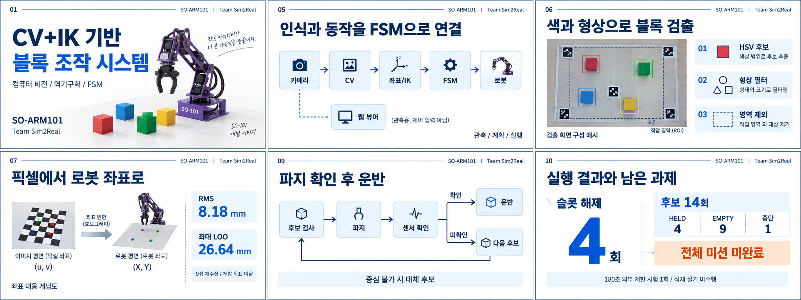
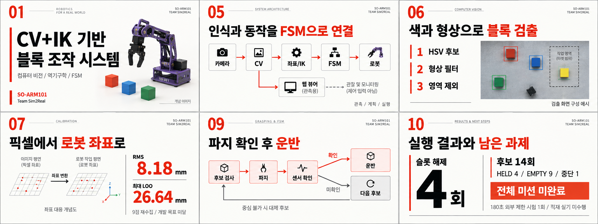
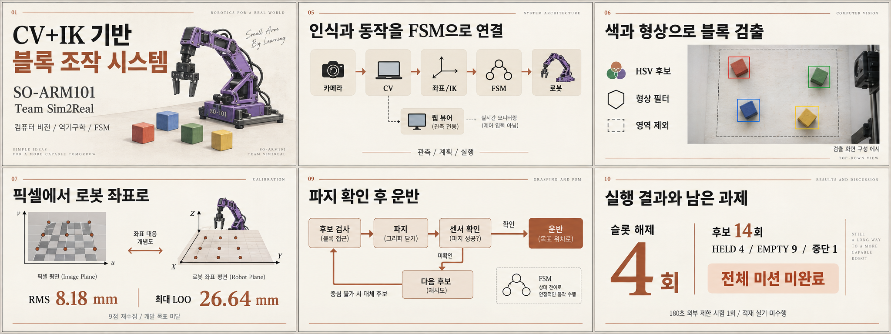
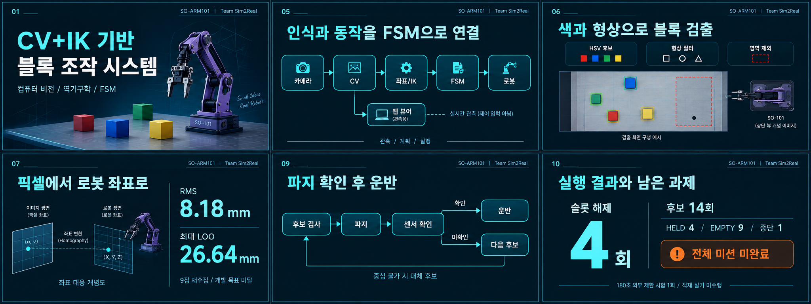
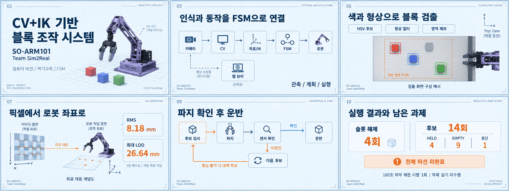
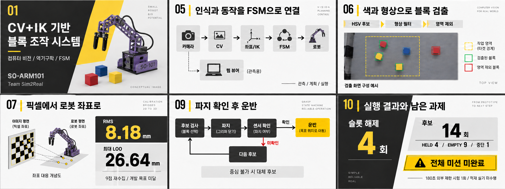
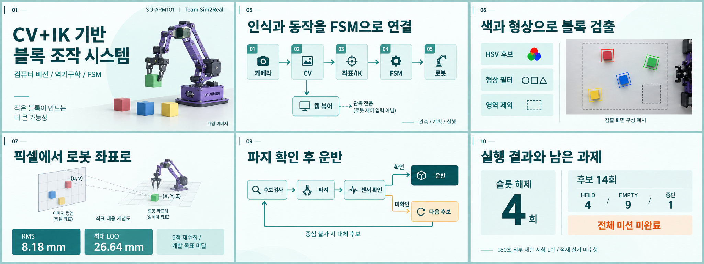
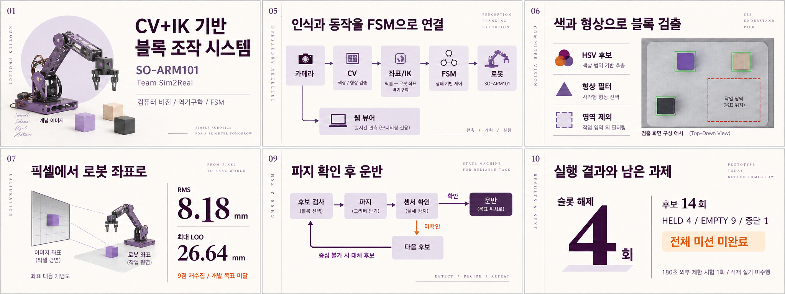
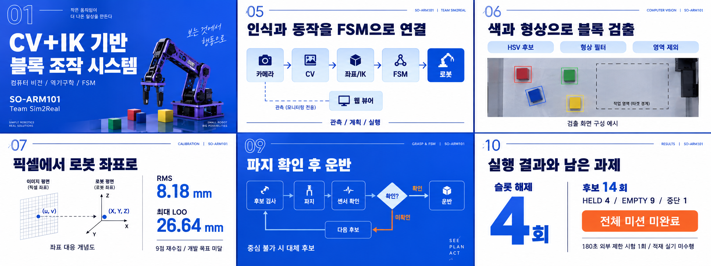
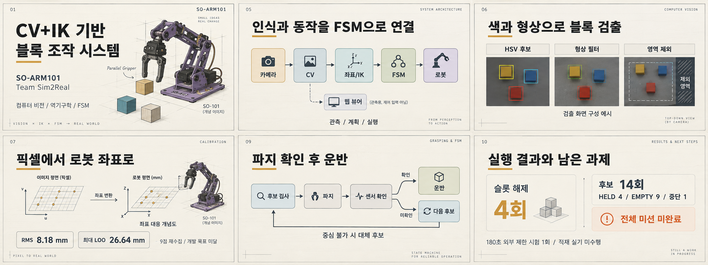

# 발표 디자인 시안 10종

각 PNG에 핵심 슬라이드 6장을 가로 3 × 세로 2로 배치했다. 모든 최종본은 2048×768이다. 내장 image_gen으로 생성했고, 서브에이전트 3개가 01~08을 담당하고 주 에이전트가 09~10과 최종 검토/취합을 담당했다.

최종 이미지 10개는 `final/`에 있다. 프롬프트는 `prompts/`, 파일별 해시와 선택 원본은 `manifest.json`에 보관했다. 06/08은 후보 설명 문구를 교정한 버전이다.

**선택 추천:** 단정한 기본안은 01, 발표 가독성과 강조는 02, 부드러운 연구 발표는 07, 강한 첫인상은 09.

그림은 디자인 검토를 위해 생성한 개념 이미지다. 실제 PPT를 만들 때 로봇/검출 화면은 원본 실험 사진으로 교체하고, 축 표기와 영역 정의 등 세부 도식은 확정 원고로 다시 작성한다. 현재 PNG는 색상, 배치, 타이포그래피를 선택하기 위한 시안이다.

| 번호 | 디자인 | 특징 |
|---|---|---|
| 01 | [학술 청색](final/01_academic_blue.png) | 흰색/남색, 단정한 학술 발표 |
| 02 | [스위스 주홍](final/02_swiss_red.png) | 먹색/주홍, 큰 제목과 숫자 |
| 03 | [미색 편집](final/03_editorial_sand.png) | 미색/차콜/구리색, 잡지 편집 |
| 04 | [미드나이트 시안](final/04_midnight_cyan.png) | 짙은 남색/시안, 어두운 키노트 |
| 05 | [블루프린트](final/05_blueprint.png) | 도면 그리드/남색/주황 |
| 06 | [산업 모노톤](final/06_industrial_mono.png) | 백색/차콜/안전노랑 |
| 07 | [청록 연구 발표](final/07_teal_research.png) | 민트/청록, 부드러운 모듈 |
| 08 | [자주 갤러리](final/08_plum_gallery.png) | 아이보리/자주, 세로 라벨 |
| 09 | [코발트 키노트](final/09_cobalt_keynote.png) | 코발트 전면 색상과 흰색 |
| 10 | [공학 노트](final/10_lab_notebook.png) | 종이/흑연/황토색, 기술 스케치 |

## 01 학술 청색

가장 무난한 기본안.

## 02 스위스 주홍

멀리서도 잘 읽히는 강조형.

## 03 미색 편집

차분한 설명과 여백.

## 04 미드나이트 시안

어두운 무대와 화면 발표.

## 05 블루프린트

좌표와 공학 도식의 분위기.

## 06 산업 모노톤

대담한 분할과 큰 수치.

## 07 청록 연구 발표

가독성과 현대적인 인상.

## 08 자주 갤러리

편집 구성과 색상의 개성.

## 09 코발트 키노트

강한 첫인상과 큰 타이포.

## 10 공학 노트

제작 과정과 연구의 분위기.

