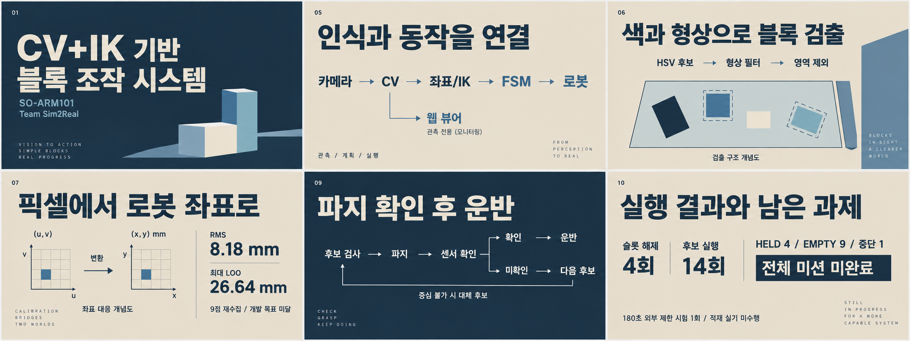
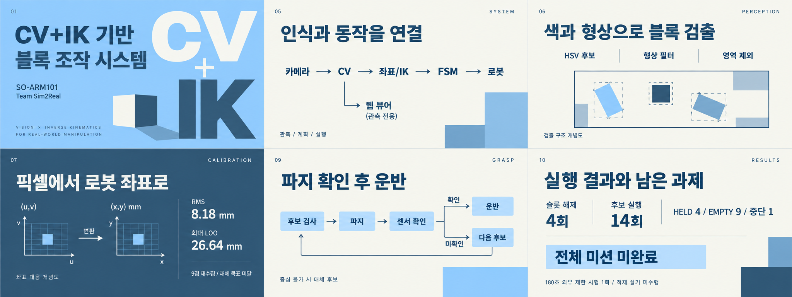
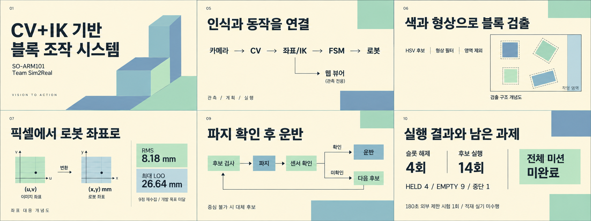
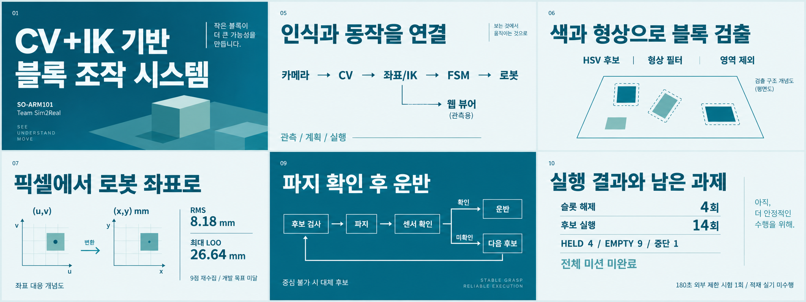
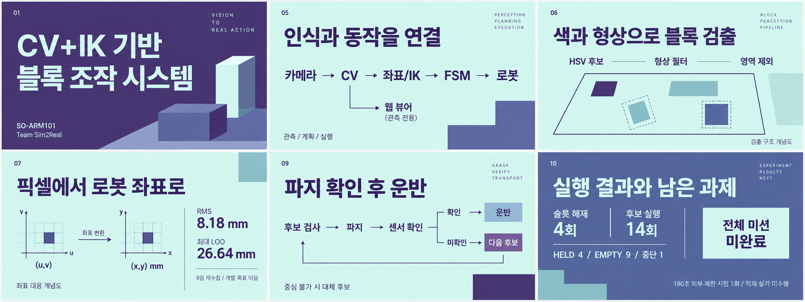

# 사용자 팔레트 발표 디자인 5종

사용자가 제시한 팔레트 순서를 그대로 유지했다. 각 PNG는 2048×768, 핵심 슬라이드 6장을 가로 3 × 세로 2로 배치한 디자인 시안이다. 내장 image_gen으로 새로 생성했으며 이전 이미지의 단순 재색칠이 아니다.

공통 구성: 표지, 시스템 구성, 비전 검출, 캘리브레이션, 파지/FSM, 실행 결과.

로봇 렌더와 실험 사진을 대신해 추상 블록, 큰 타이포그래피와 도식을 사용했다. 주요 수치와 파지 확인/미확인 분기를 검토했다. 생성 도식은 디자인 참고용이며 실제 실험 관측 그림이 아니다.

**색 사용:** 1/2/4/5는 제공된 가장 짙은 색을 본문색으로 사용한다. 밝은 색만 있는 3번은 가독성을 위해 본문과 필요한 선에 중립색 `#26343C`를 보조로 사용한다. 배경과 색면은 제공 팔레트에 맞췄다.

아래 HEX는 사용자가 준 원래 색상값이다. 생성 이미지에는 미세한 음영과 색 변화, 일부 추가 소형 문구가 있어 픽셀 단위 HEX 일치는 보장하지 않는다. 실제 PPT 제작 시 아래 HEX를 직접 지정하고 작은 장식 문구는 생략하면 된다.

| 번호 | 시안 | 원본 팔레트 |
|---|---|---|
| 01 | [슬레이트 / 샌드](01_slate_sand.png) | `#213448` / `#547792` / `#94B4C1` / `#EAE0CF` |
| 02 | [스틸 / 스카이](02_steel_sky.png) | `#355872` / `#7AAACE` / `#9CD5FF` / `#F7F8F0` |
| 03 | [세이지 / 크림](03_sage_cream.png) | `#80A1BA` / `#91C4C3` / `#B4DEBD` / `#FFF7DD` |
| 04 | [오션 / 미스트](04_ocean_mist.png) | `#09637E` / `#088395` / `#7AB2B2` / `#EBF4F6` |
| 05 | [바이올렛 / 민트](05_violet_mint.png) | `#473472` / `#53629E` / `#87BAC3` / `#D6F4ED` |

## 01 슬레이트 / 샌드

`#213448` / `#547792` / `#94B4C1` / `#EAE0CF`

## 02 스틸 / 스카이

`#355872` / `#7AAACE` / `#9CD5FF` / `#F7F8F0`

## 03 세이지 / 크림

`#80A1BA` / `#91C4C3` / `#B4DEBD` / `#FFF7DD`

## 04 오션 / 미스트

`#09637E` / `#088395` / `#7AB2B2` / `#EBF4F6`

## 05 바이올렛 / 민트

`#473472` / `#53629E` / `#87BAC3` / `#D6F4ED`

## 제작 파일

- `palettes.json`: 사용자 색상값과 각 시안의 디자인 지침
- `prompts/`: 실제 생성에 사용한 전체 프롬프트 5개
- `manifest.json`: 이미지 크기, 해시, 원본 팔레트 대응
- `COMMON_BRIEF.txt`: 공통 6장 내용과 배치 지침
