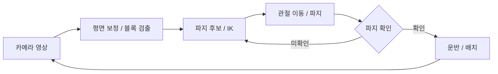

# 발표 대비 핵심 기술 정리

작성 기준: 2026-09-11, 최종보고서와 당시 확인한 구현 코드.

발표 준비는 **이 기술이 무엇인가 → 우리 시스템에서 왜 필요한가 → 어디까지 가능한가**를 설명할 수 있도록 진행한다. 아래 예상 답변은 교수님의 질문에 구두로 답하는 용도다.

## 시스템 전체 흐름

> 고정 카메라에서 블록의 위치와 방향을 구하고, 로봇이 실행할 관절 자세를 계산한 다음, 센서로 파지를 확인하면서 운반과 배치를 수행하는 시스템입니다.



이 과정의 순서와 실패 처리를 **FSM**이 관리한다. 그림은 개념적인 반복 흐름이며, 실제로는 PICK 내부의 후보 재시도와 SELECT로 돌아가는 재선택을 구분한다.

## 1. 컴퓨터 비전: 영상에서 블록의 위치와 방향 찾기

카메라 영상은 숫자로 된 픽셀의 집합이다. 여기서 어떤 픽셀들이 하나의 블록인지 구분하는 것이 검출이다.

우리 시스템은 **HSV 색상 범위로 후보를 찾고, 형상으로 걸러내는 방식**을 사용한다. HSV는 H, 색상 / S, 채도 / V, 밝기로 색을 표현하므로 색 범위를 지정하기 편하다. 다만 조명 변화의 영향을 완전히 없애주는 것은 아니다. [OpenCV 색 공간 설명](https://docs.opencv.org/4.x/df/d9d/tutorial_py_colorspaces.html)

| 처리 | 우리 시스템에서 하는 일 |
|---|---|
| 색상 마스크 | 설정한 HSV 범위에 속하는 픽셀 선택 |
| 모폴로지 | 작은 잡음 제거, 작은 구멍이나 끊어진 부분 보완 |
| 윤곽선 추출 | 연결된 영역을 물체 후보로 구성 |
| 형상 필터 | 면적, 종횡비, 채움 정도로 블록다운 후보 선별 |
| 영역 필터 | 작업 범위 밖과 지정 영역 안의 후보 제외 |

모폴로지의 **열기**는 침식 후 팽창으로 작은 잡음을 제거하고, **닫기**는 팽창 후 침식으로 작은 구멍 등을 메우는 연산이다. [OpenCV 모폴로지 설명](https://docs.opencv.org/4.x/d9/d61/tutorial_py_morphological_ops.html)

**예상 질문: 색만 보면 되지 않나요?**

> 블록과 경계 테이프의 색이 겹칠 수 있어 색만으로는 구분이 어렵습니다. 블록의 알려진 크기와 정사각형 형태를 이용해 면적과 형상 조건을 함께 검사했습니다.

## 2. 호모그래피와 캘리브레이션: 픽셀을 로봇 좌표로 연결하기

영상에서 블록 중심이 몇 번째 픽셀인지 알아도 로봇은 바로 움직일 수 없다. 로봇에는 **베이스에서 몇 mm 떨어진 위치인지**가 필요하기 때문이다.

**호모그래피는 같은 평면 위의 점들을 다른 좌표 표현으로 변환하는 관계**다. 우리 프로젝트에서는 영상 좌표와 블록 윗면 평면의 로봇 좌표를 연결한다. 3×3 행렬로 표현하지만 전체 배율을 제외하면 자유도는 8개다. [OpenCV 호모그래피 설명](https://docs.opencv.org/4.x/d9/dab/tutorial_homography.html)

$$
s
\begin{bmatrix}x\\y\\1\end{bmatrix}
=
H
\begin{bmatrix}u\\v\\1\end{bmatrix}
$$

- $u,v$: 픽셀 좌표
- $x,y$: 로봇 베이스 기준 mm 좌표
- $H$: 두 좌표를 연결하는 호모그래피 행렬
- $s$: 동차 좌표의 배율

**캘리브레이션은 이 변환 $H$를 대응점으로 추정하는 과정**이다.

우리 수집 방식은 다음과 같다.

1. 블록 윗면 중앙에 그리퍼 기준점을 맞춘다.
2. 관절값과 FK 좌표를 기록한다.
3. 블록을 움직이지 않고 팔을 치운다.
4. 영상에서 같은 블록의 중심점을 기록한다.

실제 검출에서는 이 변환으로 영상을 먼저 mm 기준 평면으로 펴고 블록을 찾는다.

**예상 질문: 왜 테이블이 아니라 블록 윗면에서 맞췄나요?**

> 검출하는 지점이 블록 윗면이기 때문입니다. 테이블 높이에서 구한 변환을 높이가 다른 블록 윗면에 적용하면 시차에 의한 위치 오차가 발생할 수 있습니다.

**카메라 위치가 바뀌거나 물체 높이가 달라지면 기존 변환의 적용 조건도 달라진다.**

## 3. FK와 IK: 관절 자세와 그리퍼 위치 연결하기

두 개념은 계산 방향이 반대다.

| 개념 | 입력 → 출력 | 답하는 질문 |
|---|---|---|
| FK, 정기구학 | 관절 각도 → 그리퍼 위치와 방향 | 지금 관절 자세라면 손끝은 어디인가? |
| IK, 역기구학 | 목표 위치와 방향 → 관절 각도 | 손끝을 거기로 보내려면 어떻게 굽혀야 하는가? |

이 계산에는 링크 길이, 관절 회전축, 연결 관계를 표현한 **URDF 로봇 모델**이 사용된다. 우리 시스템은 PlaCo 기반 계산을 사용하고, 그 위에 초기 자세 후보와 도달성 검사 등을 연결했다.

IK는 단순한 좌표 변환과 다르다. 관절 한계 때문에 해가 없거나, 가능한 자세가 여러 개거나, 수치 계산의 **초기값인 시드**에 따라 다른 결과가 나올 수 있다. 그래서 준비한 자세 후보들에서 계산을 시작하고 결과 오차를 검사한다.

### 대체 파지 후보를 사용하는 이유

> 블록 중심의 IK가 실패해도 주변의 다른 파지 후보는 실행 가능할 수 있으므로, 도달 가능한 대체 후보가 있으면 파지를 계속 시도하도록 했습니다.

이동근이 보완한 부분은 중심점 도달 실패만으로 PICK을 포기하지 않고, 실행 가능한 대체 후보를 활용하도록 FSM의 파지 조건을 수정한 것이다.

### 중립에 가까운 손목 방향을 선택하는 이유

정사각형 블록은 90도마다 동등한 면 정렬이 가능하다. 그중 **손목 중립에 가까운 방향**을 선택해 불필요한 비틀림을 줄였다.

**예상 질문: IK 계산 오차가 거의 0인데 왜 못 잡나요?**

> IK 오차는 URDF 모델 안에서 목표에 얼마나 가까운지를 나타냅니다. 실제 팔과 모델의 차이, 좌표 변환 오차, 관절 추종 오차가 남기 때문에 실제 파지는 별도로 확인해야 합니다.

웹 뷰어의 FK 표시는 **측정한 관절값으로 계산한 모델 기준점의 투영**이다. 영상을 분석해 실제 그리퍼 턱을 추적한 위치가 아니다.

## 4. 관절 궤적과 보간: 계산한 자세까지 이동하기

IK가 알려주는 것은 목표 관절 자세다. **그 자세까지 어떻게 이동할지**는 별도의 문제다.

우리는 주요 지점에서 IK를 풀고, 지점 사이에서는 관절 각도를 조금씩 바꾸는 보간을 사용한다.

$$
q(\alpha)=(1-\alpha)q_{\text{현재}}+\alpha q_{\text{목표}},
\qquad 0\leq\alpha\leq1
$$

출발점은 직전에 보낸 명령값이 아니라 **현재 측정한 관절값**이다. 실제 팔이 이전 목표에 덜 도착했을 수 있기 때문이다. 여기에 틱당 관절 변화 제한과 장비 입출력 단계의 상대 목표 제한을 적용한다.

**예상 질문: 관절을 선형 보간하면 손끝도 직선으로 움직이나요?**

> 관절 각도의 선형 변화가 손끝의 직선 이동을 보장하지는 않습니다. 손끝 위치는 관절 각도에 대해 비선형적으로 변하므로, 접근과 운반에 필요한 경유점을 별도로 구성했습니다.

**45 Hz는 명령 생성의 목표 주파수**다. 이것만으로 실제 주기가 항상 일정하다거나 하드웨어의 내부 제어 주파수가 45 Hz라고 말할 수는 없다.

## 5. 파지 검증: 닫기 명령과 실제 파지를 구분하기

그리퍼에 닫기 명령을 보냈다는 사실만으로 블록을 잡았다고 할 수는 없다. 우리는 다음 두 신호를 함께 확인한다.

| 신호 | 파지를 추정하는 이유 |
|---|---|
| 그리퍼 위치 | 물체가 끼면 빈손일 때처럼 끝까지 닫히지 않음 |
| 서보 부하 | 물체를 누르며 잡고 있으면 부하가 발생함 |

작성 당시 설정은 다섯 번 측정한 평균으로 **위치 > 12, 절대 부하 ≥ 200을 모두 만족**할 때 파지로 판단한다.

- 위치는 정규화된 서보값이며 mm가 아니다.
- 부하 역시 측정 힘을 N으로 나타낸 값은 아니다.

**예상 질문: 두 조건이면 실제 파지가 보장되나요?**

> 두 신호를 함께 사용해 빈손 상태를 구분하지만, 다른 물체에 걸린 경우까지 완전히 배제하지는 못합니다. 센서 판정의 정확도는 영상으로 확인한 실제 파지 결과와 대조해 평가해야 합니다.

## 6. FSM과 재시도: 성공과 실패에 따라 다음 행동 결정하기

FSM은 **유한 상태 머신**이다. 현재 상태와 전이 조건으로 다음 행동을 정하는 구조다.

```text
SELECT → PICK → VERIFY → TRANSPORT → PLACE → SELECT
```

핵심은 상태 이름보다 **전이 조건**이다. 특히 VERIFY에서 파지가 확인되어야 TRANSPORT로 넘어가도록 한 것이 중요하다.

재시도는 두 수준으로 구분한다.

| 수준 | 동작 |
|---|---|
| PICK 내부 후보 재시도 | 같은 블록의 다른 파지 후보 실행 |
| FSM 차원의 재선택 | 후보 소진 등의 실패 후 SELECT로 돌아가 대상 재선택 또는 다른 블록 처리 |

**예상 질문: FSM을 사용한 이유가 뭔가요?**

> 파지 확인 전 운반 금지 같은 조건을 명시하고, 실패가 어느 단계에서 발생했는지 기록하며 재시도를 관리하기 위해 사용했습니다. 이동과 적재는 배치 전략을 교체하는 구조로 분리했습니다.

**FSM이 있다는 것과 제한시간 관리가 완성됐다는 것은 별개다.** 현재 1차 미션은 외부 타이머로 180초 시험을 했고, 재시도의 시간 비용도 남아 있다. 또한 `DONE`은 검출 기반 종료 상태이므로 사람이 확인한 미션 성공과 구분해야 한다.

## 7. RMS와 LOO: 좌표 변환을 얼마나 믿을지 평가하기

캘리브레이션 숫자를 설명할 때 중요한 두 개념이다.

| 지표 | 의미 |
|---|---|
| 적합 RMS | 변환을 만드는 데 사용한 점들에서 남은 거리 오차의 제곱평균제곱근 |
| LOO, Leave-One-Out | 점 하나를 빼고 변환을 구한 뒤, 빠진 점을 얼마나 잘 예측하는지 평가 |

RMS는 다음과 같다. $e_i$는 각 대응점의 거리 오차다.

$$
\mathrm{RMS}=\sqrt{\frac{1}{N}\sum_{i=1}^{N}e_i^2}
$$

LOO는 9점이라면 8점으로 변환을 구하고 남은 1점을 평가하는 과정을 9번 반복한다. 점의 배치와 특정 대응점에 얼마나 민감한지 살펴볼 수 있다.

보고서의 재수집 9점 결과는 **RMS 8.18 mm, 최대 LOO 26.64 mm**다.

**예상 질문: 그러면 실제 파지 오차가 8.18 mm인가요?**

> 이 값은 영상 좌표와 FK로 기록한 대응점 사이의 정합 오차입니다. 실제 그리퍼 턱의 위치를 독립적으로 측정한 파지 정밀도는 아닙니다.

## 접근법 전환에 대한 예상 질문

**왜 ACT/SmolVLA에서 전환했나요?**

> 고정 카메라, 일정한 블록 규격, 평면 작업이라는 조건을 활용할 수 있었고, 실패를 인식, 좌표 변환, 동작 계획, 접촉 단계로 나누어 확인할 필요가 있었습니다. 그래서 CV, IK, FSM 구조로 전환했습니다. 동일 조건 비교는 수행하지 않아 기존 방식보다 성공률이 높아졌다고 주장하지는 않습니다.

## 이동근 담당 부분의 우선 학습 질문

- 픽셀과 FK 대응점을 어떻게 수집했는가?
- 웹 화면의 FK 표시는 무엇이며, 실제 그리퍼의 영상 추적과 어떻게 다른가?
- 중심 IK가 실패해도 다른 후보를 시도하는 이유는 무엇인가?

위 세 질문은 본인이 구현하거나 보완한 기능과 연결해 설명할 수 있도록 먼저 익힌다.

## 프로젝트 참고 자료

- [최종보고서 시스템 설계 및 구현](../report/최종보고서/sections/03_system.tex)
- [최종보고서 실험 및 평가](../report/최종보고서/sections/04_evaluation.tex)
- [발표자 노트](steel_sky_14_calm_v2_20260911/speaker_notes.md)
