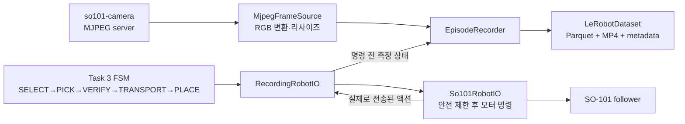

# Task 3 자동 데이터셋 수집 구현 정리

작성일: 2026-09-13  
대상 저장소: `lerobot_sim2real`  
구현 목적: Task 1의 CV+IK pick-and-place 동작을 자동 실행하면서, 성공한 동작만 ACT 학습에 사용할 수 있는 LeRobotDataset 형식으로 기록한다.

---

## 1. 요약

Task 3은 별도의 로봇 과제를 새로 수행하는 모드라기보다, **Task 1의 자동화된 수집 동작을 시연 데이터로 저장하는 데이터 수집 모드**이다. 작업자가 블록 5개를 배치하면 로봇이 다음 순서를 반복한다.

```text
home
  → 블록 탐지 및 선택
  → CV+IK 파지 1회
  → 그립 성공 검증
  → 지정구역의 빈 슬롯으로 운반
  → 릴리스
  → home 복귀
  → 성공 에피소드 저장
```

한 번의 `home → pick → transport → place → home` 사이클이 에피소드 1개이다. 파지 또는 운반에 실패한 사이클은 학습 데이터에 포함하지 않는다. 지정구역 밖의 블록이 5초 동안 보이지 않으면 한 라운드가 끝난 것으로 판단하고, 작업자에게 블록을 다시 배치한 뒤 Enter를 누르도록 요청한다.

Task 3은 다음 두 명령으로 동일하게 실행할 수 있다.

```bash
so101-collect
so101-run --task 3
```

최신 실수집 결과는 5개 색상에 대해 에피소드가 각각 1개씩, 총 5개 저장되었다. 색상별 폴더가 따로 생성되는 구조는 아니며, **하나의 데이터셋 안에서 에피소드와 `task_index`로 색상을 구분**한다.

---

## 2. 구현 목적과 범위

### 2.1 해결하려는 문제

기존의 사람 리더암 텔레오퍼레이션 방식은 작업자가 같은 동작을 반복 수행해야 한다. Task 3은 이미 구현된 Task 1의 CV+IK 자동 동작을 로봇 시연으로 사용하여 다음 항목을 자동화한다.

- 블록 탐지 및 대상 선택
- 파지 위치 계산과 IK 수행
- 실제 그립 성공 여부 확인
- 지정구역의 슬롯으로 운반 및 배치
- 관절 상태, 실행 액션, 카메라 프레임의 동기 기록
- 성공 에피소드 저장과 실패 에피소드 폐기
- 색상별 저장 수, 폐기 사유, 제어 주기 통계 기록
- 여러 블록 배치 라운드의 반복 수집
- Ctrl-C 안전 종료와 데이터셋 마무리

### 2.2 Task 1과 Task 3의 차이

| 항목 | Task 1/2 실행 | Task 3 수집 |
|---|---|---|
| 기본 동작 | 실제 과제 수행 | Task 1 동작을 시연 데이터로 기록 |
| 대상 선택 | 베이스에서 가까운 블록 우선 | 동일 |
| 파지 재시도 | 최초 실패 시 같은 XY에서 손목 롤 90° 재시도 1회 | **재시도 없이 최초 파지 1회만** |
| 하강 중 블록 걸림 | 그리퍼를 닫지 않고 상승 후 90° 재시도 | 그리퍼를 닫지 않고 실패 처리; 해당 에피소드 폐기 |
| 목적지 | 지정구역의 5개 슬롯 | 동일한 Task 1 슬롯 플래너 재사용 |
| 구역이 비었을 때 | Task 종료 | 재배치 프롬프트 후 다음 라운드 계속 |
| 종료 조건 | 과제 완료 또는 외부 제한 | 작업자가 Ctrl-C를 누를 때까지 반복 |
| 데이터 저장 | 없음 | 성공 사이클만 LeRobotDataset으로 저장 |

Task 3의 `task3.max_grasp_attempts=1`은 의도적인 설정이다. 실패 후 더듬거나 재시도하는 궤적을 성공 시연에 섞지 않고, 한 번에 성공한 깨끗한 궤적만 저장하기 위해서다.

---

## 3. 전체 구조



핵심 설계는 `RecordingRobotIO` 데코레이터이다. 프로젝트의 모든 관절 명령은 `BaseRobotIO.send_joints()`를 통과하므로, FSM이나 모션 코드 곳곳에 녹화 훅을 추가하지 않고도 단일 지점에서 전체 움직임을 기록할 수 있다.

이 구조의 장점은 다음과 같다.

- Task 1에서 검증된 PICK/VERIFY/TRANSPORT 코드를 그대로 재사용한다.
- 기록 기능이 실제 동작 로직을 변경하지 않는다.
- 로봇에 명령을 내리기 전의 관측과, 안전 제한 후 실제 전송된 액션을 한 쌍으로 저장한다.
- Task 1 동작이 수정되면 Task 3도 동일한 동작을 자동으로 수집한다.

---

## 4. 자동화 프로그램의 실행 순서

### 4.1 시작 및 사전 점검

실행 전 다음 조건이 필요하다.

1. `so101-camera`가 설정된 MJPEG 스트림을 제공해야 한다.
2. 장소 캘리브레이션 파일에 `zone_polygon_mm`과 파지 높이 정보가 있어야 한다.
3. `src/configs/poses.yaml`에 home 자세가 있어야 한다.
4. 지정구역의 5개 슬롯 모두에 대해 IK 해가 계산 가능해야 한다.
5. LeRobotDataset 기록 의존성인 `datasets`와 `av`가 설치돼 있어야 한다.

안전한 사전 점검은 다음 명령으로 실행한다.

```bash
so101-collect --dry-run
# 또는
so101-run --task 3 --dry-run
```

`--dry-run`은 모터 버스에 연결하지 않고 데이터셋도 생성하지 않는다. 다음 항목만 검사한다.

- 카메라별 연결 여부, 프레임 shape, 대략적인 수신 fps
- 생성될 데이터셋 feature schema
- 최종 데이터셋 경로와 `repo_id`
- 지정구역 슬롯 5개의 좌표, 높이, IK 오차
- 현재 지정구역 밖에서 탐지된 블록
- 색상별 task 문장

### 4.2 한 에피소드의 상세 순서

#### 1) SELECT 진입 및 home 복귀

SELECT 상태에 들어갈 때 로봇은 먼저 home으로 복귀한다. 직전에 성공한 PLACE가 있었다면 이 home 복귀 동작까지 직전 에피소드에 포함된다.

#### 2) 직전 에피소드 확정

직전 PLACE가 릴리스와 hover 복귀까지 성공했다면 에피소드를 저장한다. 성공 플래그가 없거나 오류가 있었다면 버퍼를 폐기한다.

#### 3) 최신 카메라 프레임에서 블록 탐지

Task 1의 기존 perception 경로를 사용한다. 오래됐거나 중복된 프레임은 대상 선택과 완료 판정에 사용하지 않는다. 지정구역 밖에 있는 블록만 활성 대상으로 본다.

#### 4) 대상 선택

로봇 베이스에서 가장 가까운 블록을 먼저 고른다. 거리 동률이면 평면 좌표로 결정하므로 선택 순서가 결정론적이다. 블록은 색상별로 하나씩 존재한다는 과제 조건을 사용하여 색상을 대상 ID로 쓴다.

#### 5) 에피소드 기록 시작

대상이 결정된 시점부터 에피소드 버퍼를 연다. 색상에 대응하는 task 문장도 에피소드의 모든 프레임에 연결된다.

#### 6) PICK

탐지된 블록 중심의 평면 좌표를 필요 시 근거리 보정한 뒤 top-down IK를 계산한다. Task 3에서는 중앙 파지점 한 번만 시도한다.

파지 하강 중 관절 추종 오차로 조기 막힘이 감지되면 다음과 같이 처리한다.

```text
하강 중 조기 막힘 감지
  → 그리퍼 닫기 금지
  → 열린 상태로 hover까지 상승
  → Task 3에서는 파지 실패 처리
  → 에피소드 폐기 후 SELECT/home 복귀
```

즉 Task 1/2에서 사용하는 동일 XY의 90° 롤 재시도는 Task 3의 깨끗한 단일 시도 데이터에는 포함되지 않는다.

#### 7) VERIFY

그리퍼 위치와 Feetech 부하 값을 이용해 블록이 실제로 잡혔는지 확인한다. 파지가 검증되지 않으면 TRANSPORT로 진행하지 않는다.

#### 8) TRANSPORT

검증된 블록에 다음 미사용 슬롯 번호를 할당한다. `Task1TransportPlanner`가 파지 자세, 중간 운반 waypoint, 슬롯 hover, 슬롯 drop 자세를 계산하고 순차 실행한다.

#### 9) PLACE

슬롯 drop 자세까지 하강하고 잠시 안정화한 다음 그리퍼를 연다. 이어서 슬롯 hover 자세로 상승한다. 이 과정이 끝나야만 에피소드 성공 플래그가 설정된다.

#### 10) SELECT로 돌아가 home 복귀 후 저장

PLACE 직후 바로 저장하지 않는다. 다음 SELECT의 home 복귀까지 성공적으로 끝난 뒤 에피소드를 저장한다. 따라서 저장된 에피소드는 시작과 끝이 모두 home인 닫힌 사이클이다.

### 4.3 한 라운드의 완료

지정구역 밖에서 블록이 5초 동안 탐지되지 않으면 라운드가 완료된다.

```text
외부 블록 없음 5초 확인
  → 현재 라운드 수 증가
  → 색상별 누적 저장 수 출력
  → 블록 재배치 안내 및 벨 출력
  → 작업자가 Enter 입력
  → 슬롯 할당과 라운드 상태 초기화
  → 새 배치 수집 시작
```

새 라운드에서는 슬롯 번호를 다시 0부터 사용한다. 이전 프레임과 이전 라운드의 파지 시도 상태도 초기화된다.

---

## 5. 프레임 기록 방식

### 5.1 관측과 액션의 시간 관계

한 제어 틱은 다음 순서로 저장된다.

```text
1. 현재 실제 관절 위치 읽기
2. 최신 카메라 이미지 확보
3. pre-action observation 임시 보관
4. 로봇에 관절 목표 전송
5. 로봇 안전 제한이 적용된 실제 전송값 반환
6. observation과 post-safety action을 한 프레임으로 저장
```

저장 feature는 다음과 같다.

- `observation.state`: 액션 실행 전 측정된 6개 관절 위치
- `observation.images.top`: 같은 틱의 최신 탑 카메라 RGB 영상
- `action`: 안전 제한 후 로봇에 실제 전송된 6개 관절 목표
- `task`: 선택한 블록 색상에 대응하는 문장

관절 순서는 두 벡터에서 동일하다.

```text
shoulder_pan
shoulder_lift
elbow_flex
wrist_flex
wrist_roll
gripper
```

초기 구현에서는 안전 제한 전의 요청 액션이 기록될 수 있었다. 현재 구현은 `So101RobotIO.send_joints()`가 반환한 **실제 전송값**을 기록하도록 수정됐다. 따라서 정책이 하드웨어가 수행하지 않은 큰 점프를 정답으로 학습하는 문제를 방지한다.

`action - observation.state`는 0일 필요가 없다. 액션은 목표값이고 observation은 명령 직전의 측정값이므로, 모터 추종 지연이 있으면 둘 사이에 차이가 생기는 것이 정상이다.

### 5.2 기록 주기

- 데이터셋 표기 fps: 30 Hz
- Task 3 실행 중 `motion.fps` override: 300 Hz
- 실제 30 Hz 페이싱 담당: `RecordingRobotIO`

기존 `TrajectoryPlayer`의 sleep은 작업 시간에 추가로 `1/fps`를 쉬는 방식이어서 정확한 30 Hz를 만들 수 없다. 따라서 Task 3에서는 그 sleep 영향을 작게 만들고, `RecordingRobotIO`가 절대 시간 deadline으로 제어 틱을 30 Hz에 맞춘다.

LeRobotDataset의 timestamp는 `frame_index / fps`로 구성되므로 실측 주기가 30 Hz에서 크게 벗어나면 재생 속도와 실제 시연 속도가 달라진다. 수집 종료 요약의 `tick_report`를 반드시 확인해야 한다.

### 5.3 카메라 처리

Task 3은 카메라 장치를 직접 열지 않는다. `/dev/video*`의 단일 소유자인 `so101-camera` 서버의 MJPEG 스트림을 읽는다.

`MjpegFrameSource`는 백그라운드 스레드에서 다음을 수행한다.

1. MJPEG 연결을 지속 유지한다.
2. 각 JPEG 프레임을 OpenCV로 디코딩한다.
3. 설정된 공통 해상도로 리사이즈한다.
4. OpenCV BGR을 ACT 입력과 동일한 RGB로 변환한다.
5. 최신 프레임과 수신 시각을 원자적으로 갱신한다.
6. 스트림 오류 시 자동 재연결한다.

현재 설정은 탑 카메라 하나이다.

```yaml
task3:
  cameras:
    top: http://127.0.0.1:8090/video/shoulder.mjpg
  image_width: 640
  image_height: 480
```

손목 카메라를 추가할 수 있도록 카메라 이름과 URL이 dict 구조로 구현돼 있다. 여러 카메라를 사용할 경우 모든 `observation.images.*` feature는 동일한 크기로 저장된다. 단, 한 데이터셋을 수집하는 도중 카메라 구성을 바꾸면 schema가 달라지므로 새 데이터셋을 시작해야 한다.

### 5.4 오래된 카메라 프레임 처리

- `max_frame_age_s=0.5`: 0.5초보다 오래된 프레임은 해당 틱에서 기록하지 않는다.
- `max_stale_ticks=10`: 신선한 프레임을 연속 10틱 받지 못하면 에피소드 전체를 `stale_camera`로 폐기한다.

프레임 사이에 긴 공백이 생긴 데이터를 저장하면 정책이 실제로 존재하지 않았던 상태 점프를 학습할 수 있으므로, 누락 틱을 억지로 연결하지 않고 에피소드를 버리는 정책을 사용한다.

---

## 6. 에피소드 저장 및 폐기 규칙

### 6.1 저장 조건

다음 조건을 모두 만족해야 저장된다.

- 대상 블록이 선택됐다.
- 파지 검증에 성공했다.
- 지정구역 슬롯까지 운반했다.
- 블록을 릴리스했다.
- 슬롯 hover로 다시 상승했다.
- 이어지는 home 복귀까지 완료했다.
- 프레임 수가 `min_episode_frames=60` 이상이다.
- 프레임 수가 `max_episode_frames=3000`을 넘지 않았다.
- 수집 중 카메라가 장시간 stale 상태가 아니었다.

### 6.2 폐기 사유

| 사유 | 의미 |
|---|---|
| `pick_failed` | 단 한 번의 파지 또는 그립 검증 실패 |
| `too_short` | 60프레임 미만 |
| `too_long` | 3000프레임 초과 또는 루프 이상 가능성 |
| `stale_camera` | 신선한 카메라 프레임을 연속 10틱 받지 못함 |
| `interrupted` | 진행 중 Ctrl-C |
| `shutdown` | 종료 정리 시 아직 열린 에피소드가 남아 있음 |
| `unfinished` | 새 에피소드를 시작할 때 이전 버퍼가 정상적으로 닫히지 않음 |

폐기는 메모리의 현재 episode buffer만 비운다. 앞에서 이미 `save_episode()` 된 에피소드에는 영향을 주지 않는다.

저장된 에피소드가 하나도 없는 신규 실행은 빈 데이터셋 디렉터리까지 제거한다. 빈 디렉터리가 남아 다음 실행의 `LeRobotDataset.create()`와 충돌하는 문제를 막기 위한 처리다.

---

## 7. Ctrl-C 종료 처리

### 7.1 어느 시점에서 눌러도 되는가

Ctrl-C는 다음 모든 시점에서 처리된다.

- 블록을 향해 이동 중
- 파지·운반·배치 중
- 다음 블록을 SELECT하는 카메라 polling 중
- 블록 5개를 다 처리하기 전
- 라운드 완료 후 Enter를 기다리는 중

예를 들어 5개 중 3개 에피소드가 이미 저장된 후 네 번째 동작 도중 Ctrl-C를 누르면 다음과 같이 된다.

```text
앞의 완료 에피소드 3개: 보존
현재 진행 중인 네 번째 에피소드: 폐기
아직 시작하지 않은 다섯 번째: 없음
로봇: 그리퍼 열기 → home 복귀
데이터셋: parquet/영상 metadata 마무리 후 종료
```

### 7.2 무한 대기 문제의 수정

기존에는 재배치 안내의 Python `input()`이 SIGINT 이후에도 blocking read 상태로 남을 수 있었다. 화면에는 “저장을 마칩니다”가 출력됐지만 실제로는 입력 대기에서 빠져나오지 못해 무한 로딩처럼 보이는 문제가 있었다.

현재 구현은 다음과 같이 수정됐다.

- 터미널 입력은 daemon thread가 담당한다.
- 메인 제어 스레드는 0.1초 간격으로 stop event를 확인한다.
- SELECT의 카메라 polling 전후에도 stop event를 확인한다.
- 로봇 명령을 보내기 직전의 tick 경계에서도 stop event를 확인한다.
- 종료 중 두 번째 Ctrl-C는 무시하여 parquet/MP4 finalization 손상을 막는다.

SIGINT handler 안에서 즉시 모터/파일 로직을 실행하지 않고 flag만 세운다. 실제 중단은 버스 write 도중이 아닌 안전한 명령 경계에서 발생한다.

### 7.3 Ctrl-D 주의

정상 종료 키는 **Ctrl-C**이다. Ctrl-D는 stdin EOF를 발생시키므로 재배치 prompt에서 `Collection aborted` 오류 경로로 종료될 수 있고, 정상 summary JSON이 작성되지 않을 수 있다. 데이터 파일 finalization은 context manager가 최대한 수행하지만, 운영 절차에서는 Ctrl-D를 사용하지 않는다.

영상 인코딩과 통계 작성 때문에 Ctrl-C 직후 잠시 출력이 없을 수 있다. 정상 종료라면 마지막에 저장 에피소드 수, 색상별 개수, 기록 주기, 데이터셋 경로, summary 경로가 출력된다.

---

## 8. 데이터셋이 쌓이는 위치와 디렉터리 구조

### 8.1 기본 저장 위치

기본 설정은 다음과 같다.

```yaml
task3:
  repo_id: local/so101_task3
  root: ""
  stamp_repo_id: true
```

`root`가 비어 있으면 LeRobot의 기본 캐시 경로 아래에 저장된다.

```text
$HF_LEROBOT_HOME/{repo_id_타임스탬프}
```

현재 환경의 실제 기본 경로는 다음과 같다.

```text
/home/mseoky/.cache/huggingface/lerobot/local/
```

실행마다 이름 뒤에 `_YYYYMMDD_HHMMSS`가 붙으므로 기존 수집본을 덮어쓰지 않는다.

```text
/home/mseoky/.cache/huggingface/lerobot/local/
└── so101_task3_20260913_224928/
```

### 8.2 한 데이터셋의 파일 구조

최신 수집본은 다음 구조다.

```text
so101_task3_20260913_224928/
├── data/
│   └── chunk-000/
│       └── file-000.parquet
├── meta/
│   ├── episodes/
│   │   └── chunk-000/
│   │       └── file-000.parquet
│   ├── info.json
│   ├── stats.json
│   └── tasks.parquet
└── videos/
    └── observation.images.top/
        └── chunk-000/
            └── file-000.mp4
```

각 파일의 역할은 다음과 같다.

| 파일 | 역할 |
|---|---|
| `data/...parquet` | 프레임별 action, 관절 observation, timestamp, 각종 index |
| `videos/...mp4` | 프레임별 탑 카메라 영상; H.264로 이어 붙여 저장 |
| `meta/episodes/...parquet` | 각 에피소드의 길이, 데이터 범위, 영상 시간 범위, task, 통계 |
| `meta/tasks.parquet` | `task_index`와 색상별 자연어 task 문장 매핑 |
| `meta/info.json` | fps, feature shape, 관절 이름, 전체 에피소드/프레임 수, 경로 형식 |
| `meta/stats.json` | 전체 데이터셋의 feature별 통계 |

### 8.3 왜 parquet 파일이 일반 편집기로 열리지 않는가

Parquet은 텍스트 파일이 아니라 바이너리 columnar 형식이다. 메모장이나 일반 Markdown 편집기로 열 수 없는 것이 정상이다. Python의 PyArrow, Pandas 또는 LeRobotDataset API로 읽어야 한다.

```bash
.venv/bin/python - <<'PY'
import pyarrow.parquet as pq

path = "/home/mseoky/.cache/huggingface/lerobot/local/so101_task3_20260913_224928/data/chunk-000/file-000.parquet"
table = pq.read_table(path)
print(table.schema)
print(table.slice(0, 5).to_pandas())
PY
```

---

## 9. 색상별 데이터가 저장되는 방식

색상별로 별개의 폴더에 저장되지 않는다. 한 라운드의 5개 에피소드가 같은 data parquet와 같은 MP4 파일에 연속 저장된다.

구분은 다음 metadata로 한다.

- `episode_index`: 에피소드 번호
- `task_index`: 색상별 task 문장을 가리키는 번호
- `meta/tasks.parquet`: `task_index → task 문장` 매핑
- `meta/episodes/...parquet`: 각 episode의 task, 프레임 범위, 영상 시간 범위

최신 예에서는 다음처럼 매핑됐다.

| episode_index | 색상/task | 프레임 수 | 전역 데이터 index 범위 | MP4 시간 범위 |
|---:|---|---:|---:|---:|
| 0 | blue | 429 | `[0, 429)` | 0.000–14.300 s |
| 1 | yellow | 424 | `[429, 853)` | 14.300–28.433 s |
| 2 | red | 400 | `[853, 1253)` | 28.433–41.767 s |
| 3 | wood | 430 | `[1253, 1683)` | 41.767–56.100 s |
| 4 | green | 428 | `[1683, 2111)` | 56.100–70.367 s |

색상별 데이터만 보고 싶다면 `task_index`나 `episode_index`로 필터링한다. 다만 학습에서는 색상별 폴더 분리보다 위치·배치·접근 각도 다양성을 확보한 하나의 공통 데이터셋으로 사용하는 편이 중요하다.

---

## 10. 최신 수집 예시

### 10.1 실행 결과

```text
run_id       : task3_20260913_224922
repo_id      : local/so101_task3_20260913_224928
dataset_root : /home/mseoky/.cache/huggingface/lerobot/local/so101_task3_20260913_224928
rounds       : 1
saved        : 5 episodes
discarded    : 0
operator stop: true
```

색상별 저장 수:

```text
blue   1
yellow 1
red    1
wood   1
green  1
```

### 10.2 파일 및 데이터 규모

| 항목 | 값 |
|---|---:|
| 전체 에피소드 | 5 |
| 전체 프레임 | 2,111 |
| 데이터 fps | 30 |
| 영상 코덱 | H.264 |
| 영상 해상도 | 640 × 480 RGB |
| 영상 프레임 | 2,111 |
| 영상 재생 시간 | 70.3667 s |
| main parquet 크기 | 127,547 bytes |
| episode metadata 크기 | 49,499 bytes |
| tasks metadata 크기 | 2,368 bytes |
| stats 크기 | 9,951 bytes |
| MP4 크기 | 16,452,797 bytes |

### 10.3 구조 검증 결과

- main parquet 2,111행과 MP4 2,111프레임이 일치한다.
- episode metadata의 길이 합계도 2,111이다.
- 전역 `index` 중복이 없다.
- main parquet의 결측값이 없다.
- 5개 episode와 5개 task 문장이 정상 연결돼 있다.
- observation/action은 모두 6차원이며 관절 순서가 일치한다.
- 영상의 색상 채널을 시각 검수한 결과 팔의 보라색, 빨강 테이프, 블록 색상이 정상으로 보여 RGB 변환이 올바르다.
- 영상 중간 프레임에서 블록이 순차적으로 지정구역 슬롯에 들어가는 흐름을 확인했다.

### 10.4 제어 주기 출력 예시

수집 종료 시 목표 주기, 실측 평균, p50, p95, p99, 최대 지연이 자동 계산되어 summary JSON에 남는다. 따라서 데이터 파일의 fps 표기뿐 아니라 실제 로봇 제어 주기도 실행 단위로 추적할 수 있다.

### 10.5 관련 로그

```text
logs/pick_stack/task3_20260913_224922_summary.json
logs/pick_stack/task3_20260913_224922_transitions.csv
```

summary JSON에는 색상별 저장/폐기 수, 폐기 사유, 라운드 수, 기록 주기, 데이터셋 경로가 저장된다. transitions CSV에는 SELECT/PICK/VERIFY/TRANSPORT/PLACE 상태 전환 시각, 대상 색상, 그립 검증값, 할당 슬롯이 기록된다.

---

## 11. 학습 데이터로 활용하는 방법

### 11.1 직접 제공되는 학습 입력과 정답

프레임마다 다음 지도학습 쌍이 제공된다.

```text
입력:
  observation.images.top  현재 RGB 영상
  observation.state       현재 6축 관절 상태

정답:
  action                  다음에 보낸 6축 관절 목표

메타데이터:
  task_index / task       대상 색상 문장
  episode_index           에피소드 경계
```

따라서 LeRobot의 ACT 데이터 로더가 기대하는 영상·state·action 구조로 읽을 수 있다. 데이터셋의 `train` split은 현재 episode 0–4 전체다.

### 11.2 현재 Task 3 데이터가 가르치는 행동

현재 에피소드 경계는 PICK 구간만이 아니라 다음 전체 사이클이다.

```text
home → 대상 접근 → 파지 → 들어 올림 → 지정구역 운반 → 배치 → home
```

즉 이 데이터를 그대로 학습하면 ACT는 **Task 1 전체 사이클을 모방하는 정책**을 학습하게 된다. 프로젝트의 최종 구조가 `NN=PICK, Rules=TRANSPORT/PLACE`라면 현재 데이터셋을 그대로 넣는 것이 아니라 PICK 구간만 잘라야 한다.

현재 main parquet에는 `phase=pick/transport/place`와 같은 프레임별 상태 label이 없다. transitions CSV에는 FSM 상태 전환의 wall time이 있으므로 후처리 기준으로 활용할 수 있지만, 정확한 자동 segmentation을 지속 사용하려면 향후 데이터에 phase index를 넣거나 episode boundary를 PICK 종료로 바꾸는 방안이 필요하다.

또한 현재 Task 3은 Task 1 배치 데이터만 만든다. **Task 2의 stack-alignment 행동은 포함하지 않는다.** 하나의 ACT 정책에 PICK과 STACK-ALIGN 두 행동을 모두 학습시키려면 별도의 stack-align 에피소드를 같은 schema/한 모델 학습 세트에 추가해야 한다.

### 11.3 자연어 task 문장의 역할

색상별 문장이 `meta/tasks.parquet`에 저장되지만, 학습 구성에 따라 ACT가 이 문장을 실제 조건 입력으로 사용하지 않을 수 있다. 문장이 저장됐다는 사실과 모델이 언어 조건을 학습한다는 사실은 다르다. 현재 task 문장은 우선 색상·에피소드 식별용 metadata로 보는 것이 안전하며, 언어 조건을 쓰려면 학습 pipeline이 `task`를 입력 feature로 소비하는지 별도 확인해야 한다.

### 11.4 자동 시연 데이터의 장점

- 동일한 코드 경로로 반복 수집해 labeling 방식이 일정하다.
- 성공한 grasp-and-delivery만 저장되므로 실패 동작이 정답에 섞이지 않는다.
- CV 좌표와 IK가 커버하는 작업 공간을 빠르게 대량 수집할 수 있다.
- 정책이 rule-based controller를 모방하도록 하는 bootstrap/distillation 데이터로 사용할 수 있다.
- 로봇·카메라·조명 조건이 실제 배포 환경과 같다면 sim-to-real 차이가 적다.

### 11.5 데이터 활용 시 고려사항

자동 시연은 규칙 기반 controller의 능력과 편향을 그대로 복제한다.

- `max_grasp_attempts=1`이고 실패 episode를 버리므로 **실패 후 복구 행동은 전혀 학습되지 않는다.**
- CV+IK가 성공하는 위치만 남으므로 어려운 위치가 데이터에서 사라질 수 있다.
- 같은 슬롯 궤적이 반복돼 transport/place 데이터가 과도하게 결정론적일 수 있다.
- 현재는 탑 카메라 1개를 사용하며, 필요하면 동일 shape의 손목 카메라 feature를 추가할 수 있다.
- 한 배치에서 연속으로 5개를 옮기면 후반 episode일수록 바닥에 남은 블록 수가 적어져 초기 평가 장면과 분포가 달라진다.

반복 수집 시에는 색상별 개수만 맞추기보다 전체 작업영역에서 위치·배치·접근 방향이 다양하게 포함되도록 구성하는 것이 중요하다.

빨강 블록과 빨강 테이프가 함께 있는 어려운 장면도 피하지 말고 포함해야 한다. 지정구역은 색으로 찾는 것이 아니라 캘리브레이션된 고정 좌표를 사용하고, 블록 검출은 색상과 형상을 함께 쓰므로 이 간섭 조건 자체가 유용한 검증 및 학습 사례다.

### 11.6 최신 수집본 확인 결과

| 관점 | 최신 5-episode 수집본 판정 |
|---|---|
| 파일 완결성 | 양호 |
| parquet/MP4 프레임 정합 | 양호 |
| 결측·중복 | 문제 없음 |
| RGB 영상 | 정상 |
| 색상별 분리 식별 | 정상; metadata로 각 1개 |
| post-safety action 기록 | 현재 코드에서 수정 완료 |
| 시간 주기 통계 | summary에 정상 기록됨 |
| 복구 행동 포함 여부 | Task 3 설계상 포함하지 않음 |

---

## 12. 실행 명령

### 12.1 의존성 설치

Jetson의 PyTorch를 덮어쓰지 않도록 전체 `uv sync` 대신 필요한 패키지만 설치한다.

```bash
cd /home/mseoky/lerobot_sim2real
uv pip install --python .venv/bin/python \
  "datasets>=4.7.0,<5.0.0" \
  "av>=15.0.0,<16.0.0"
```

### 12.2 카메라 시작

```bash
so101-camera
```

### 12.3 dry-run

```bash
so101-collect --dry-run
# 동일 별칭
so101-run --task 3 --dry-run
```

### 12.4 수집 시작

```bash
so101-collect
# 동일 별칭
so101-run --task 3
```

`so101-run --task 3`은 고정 CV+IK 수집 flow를 사용한다. `--pick-mode`, `--flow`, `--color`를 함께 지정하면 오류로 거부한다.

### 12.5 데이터셋 이름 지정

```bash
so101-collect --set task3.repo_id=local/so101_task3_session_a
```

### 12.6 기존 데이터셋에 이어서 수집

```bash
so101-collect --resume \
  --set task3.repo_id=local/so101_task3_20260913_224928 \
  --set task3.root=/home/mseoky/.cache/huggingface/lerobot/local/so101_task3_20260913_224928
```

`--resume`은 정확한 timestamp 포함 `repo_id`와 정확한 root가 모두 필요하다. 현재 `so101-run --task 3` 별칭은 `--resume` 옵션을 노출하지 않으므로 이어쓰기는 `so101-collect`를 사용한다.

서로 다른 카메라 구성이나 feature schema를 가진 수집본을 같은 root에 resume하면 안 된다.

---

## 13. 데이터 검수 예제

### 13.1 LeRobotDataset으로 열기

```bash
PYTHONPATH=src .venv/bin/python - <<'PY'
from lerobot.datasets import LeRobotDataset

repo_id = "local/so101_task3_20260913_224928"
root = "/home/mseoky/.cache/huggingface/lerobot/local/so101_task3_20260913_224928"

ds = LeRobotDataset(repo_id, root=root)
print("episodes:", ds.num_episodes)
print("frames:", ds.num_frames)
print("fps:", ds.fps)

sample = ds[0]
print("image:", sample["observation.images.top"].shape)
print("state:", sample["observation.state"].shape)
print("action:", sample["action"].shape)
PY
```

### 13.2 Parquet의 에피소드 수 확인

```bash
.venv/bin/python - <<'PY'
import pyarrow.parquet as pq

root = "/home/mseoky/.cache/huggingface/lerobot/local/so101_task3_20260913_224928"
data = pq.read_table(f"{root}/data/chunk-000/file-000.parquet").to_pandas()
episodes = pq.read_table(f"{root}/meta/episodes/chunk-000/file-000.parquet").to_pandas()
tasks = pq.read_table(f"{root}/meta/tasks.parquet").to_pandas()

print(data.groupby("episode_index").size())
print(episodes[["episode_index", "tasks", "length"]])
print(tasks)
PY
```

### 13.3 영상 정보 확인

```bash
ffprobe -v error -select_streams v:0 -count_frames \
  -show_entries stream=codec_name,width,height,r_frame_rate,nb_read_frames,duration \
  -of json \
  /home/mseoky/.cache/huggingface/lerobot/local/so101_task3_20260913_224928/videos/observation.images.top/chunk-000/file-000.mp4
```

### 13.4 수집 후 필수 체크리스트

- summary의 `episodes_saved`가 실제 의도한 성공 횟수와 같은가
- `episodes_saved_by_color`가 지나치게 한 색상에 편향되지 않았는가
- `discard_reasons`에 `stale_camera`가 반복되지 않는가
- parquet 프레임 수와 MP4 프레임 수가 같은가
- 에피소드 길이가 비정상적으로 짧거나 길지 않은가
- RGB 색상이 실제 장면과 같은가
- 파지·릴리스 시점에서 영상과 action이 자연스럽게 대응하는가
- `tick_report`가 `ok`인가
- 동일 위치만 반복하지 않고 전체 작업영역을 커버했는가
- 빨강 블록/빨강 테이프 간섭 사례가 포함됐는가

---

## 14. 구현 파일별 역할

| 파일 | 구현 내용 |
|---|---|
| `src/runners/run_task3.py` | Task 3 실행, dry-run, 데이터셋 생성, 안전 종료, summary 작성 |
| `src/runners/run_task.py` | `so101-run --task 3` 별칭 연결 |
| `src/data/episode_recorder.py` | dataset schema, episode 생명주기, 성공/폐기 정책, 기록 데코레이터, fps 통계 |
| `src/camera/frame_source.py` | MJPEG 지속 수신, 백그라운드 디코딩, 리사이즈, BGR→RGB, stale 정보 |
| `src/fsm/task3.py` | episode 경계, 성공 확정, 라운드 완료 및 재배치 prompt, SELECT 중 stop 확인 |
| `src/fsm/flows.py` | Task 1 핸들러와 Task 3 전용 SELECT/PLACE 조립 |
| `src/control/robot_io.py` | 안전 제한 후 실제 전송된 action 반환 |
| `src/control/grasp.py` | Task 3의 1회 파지 제한, 조기 막힘 시 그리퍼 닫기 금지 |
| `src/config.py` | `Task3Config` 자료형과 validation |
| `src/configs/default.yaml` | 카메라, fps, frame 범위, stale 기준, task 문장 기본값 |
| `pyproject.toml` | `so101-collect` entrypoint와 collect 의존성 |
| `tests/test_task3.py` | episode 저장/폐기, fps, Ctrl-C, alias, dry-run, resume 등 테스트 |
| `README.md` | 사용자 실행 명령 요약 |

구현 후 전체 테스트 결과는 다음과 같다.

```text
198 passed in 24.81s
```

또한 `so101-run --task 3 --dry-run`이 모터와 데이터셋을 건드리지 않고 정상 완료하는 것을 확인했다.

---

## 15. 확장 가능 지점

1. **제어 주기 세부 계측**  
   버스 read/write, 카메라, CPU 부하, image copy 구간별 시간을 추가하면 지연 원인을 더 세밀하게 분석할 수 있다.

2. **다양한 레이아웃 반복 수집**  
   전체 arena의 위치, 가림, 접근 방향이 고르게 포함되도록 라운드별 블록 배치를 바꿔 수집한다.

3. **PICK-only segmentation 결정**  
   현재 한 episode는 Task 1 전체 사이클이다. 최종 ACT의 책임을 PICK으로 제한한다면 수집 경계 또는 후처리를 변경해야 한다.

4. **STACK-ALIGN 데이터 추가**  
   현재 데이터에는 Task 2의 접촉 기반 적층 정렬이 없다. 한 모델로 PICK+STACK-ALIGN을 학습할 경우 같은 dataset format으로 두 번째 episode 유형을 추가해야 한다.

5. **복구 시연 추가**  
   현재 자동 성공 episode와 별도로 재정렬·재접근 recovery 시연을 같은 학습 세트에 추가할 수 있다.

6. **손목 카메라 검토**  
   근접 시야를 추가하려면 손목 카메라를 설정하되, 기존 dataset에 resume하지 말고 새 schema의 데이터셋을 만든다.

7. **Hub 업로드 미구현**  
   현재 runner는 `push_to_hub()`를 호출하지 않는다. 모든 데이터는 로컬에만 남으므로 백업·병합·전송은 별도 절차가 필요하다.

8. **이전 pre-clamp 수집본 구분**  
   액션 기록 수정 이전에 만든 초기 데이터셋은 요청 액션이 label로 들어갔을 가능성이 있으므로 최종 학습에 섞지 않고 QA용으로만 보관한다. 최신 `so101_task3_20260913_224928`은 수정 후 수집본이다.

9. **Ctrl-D 비지원**  
   정상 종료와 summary 보존을 위해 항상 Ctrl-C를 사용한다.

---

## 16. 결론

Task 3은 Task 1의 실제 CV+IK 동작 경로를 변경하지 않고, 로봇 I/O 경계에서 관측과 실행 액션을 LeRobotDataset으로 기록하도록 구현됐다. 성공한 `home → pick → transport → place → home` 사이클만 저장하며, 카메라 stale, 파지 실패, 비정상 길이, 작업자 중단은 현재 episode만 폐기한다. Ctrl-C는 동작 중·SELECT 중·재배치 prompt 중 어디서든 처리되며, 앞서 완료한 episode는 보존된다.

최신 수집본은 5색 각 1개, 총 5 episode와 2,111 frame으로 구조적 완결성, 영상/테이블 정합, RGB 색상, task metadata가 정상임을 확인했다. 종료 summary와 transitions 로그를 통해 색상별 저장 결과, 상태 전환, 제어 주기도 함께 추적할 수 있다.

---

## 17. 보고서에 넣기 좋은 시각자료

보고서 본문에는 다음 네 가지를 넣는 구성이 가장 효율적이다.

### 그림 1. Task 3 전체 아키텍처

이 문서 3장의 Mermaid 흐름도를 이미지로 내보내 사용한다. 카메라, FSM, `RecordingRobotIO`, 로봇, LeRobotDataset 사이의 관계를 한 장에서 보여 줄 수 있다.

권장 캡션:

> 그림 1. Task 1의 CV+IK FSM을 재사용하고 로봇 I/O 경계에서 관측과 실제 전송 액션을 기록하는 Task 3 구조

### 그림 2. 대표 에피소드 시퀀스

한 에피소드의 MP4에서 다음 6장면을 같은 간격의 contact sheet로 만든다.

```text
home → 접근 → 그리퍼 하강 → 블록 파지/리프트 → 슬롯 배치 → home 복귀
```

색상별 완성 사진 5장을 나열하는 것보다, 하나의 episode가 어떤 행동 구간을 포함하는지 보여 주는 시퀀스가 구현 설명에 더 유용하다. 별도로 최종 지정구역에 5색 블록이 모두 들어간 사진 한 장을 결과 사진으로 추가할 수 있다.

권장 캡션:

> 그림 2. 하나의 LeRobot episode에 기록되는 home-to-home pick-and-place 동작 시퀀스

### 그림 3. 데이터셋 저장 구조

8.2장의 디렉터리 트리를 그대로 도식이나 터미널 캡처로 넣는다. Parquet에는 관절 데이터와 index가, MP4에는 영상이, meta에는 episode/task mapping이 들어간다는 점을 화살표로 표시하면 좋다.

권장 캡션:

> 그림 3. LeRobotDataset v3 저장 구조와 파일별 역할

### 그림 4. 실제 실행 및 정상 종료 로그

실행 로그는 다음 부분만 남기고 캡처한다.

```text
-> HELD pos=49.0 load=264
pick -> verify
verify -> transport ... grasp_ok
transport -> place ... assigned_slot=4
place -> select ... released_slot=4
Saved green episode (428 frames); 5 saved this run

라운드 1 완료
이번 라운드 저장: 5개 / 누적: 5개

=== Task 3 finished: 5 episode(s) saved over 1 round(s) ===
by colour : blue 1, green 1, red 1, wood 1, yellow 1
discarded : none
dataset   : .../so101_task3_20260913_224928
```

`libx264`의 profile, macroblock, QP, bitrate 상세 출력은 H.264 인코딩 내부 로그이므로 본문 캡처에서는 제거한다. 인코딩이 실제 수행됐다는 근거가 필요하면 `Map: 100%` 한 줄이나 최종 MP4 정보 표만 남긴다.

권장 캡션:

> 그림 4. 파지 검증부터 에피소드 저장 및 Ctrl-C 정상 종료까지의 실제 Task 3 실행 로그

### 표 1. 색상별 에피소드 수집 결과

10장의 episode 표를 사용한다. 색상마다 1개라면 막대그래프보다 표가 정보 밀도가 높다. `episode_index`, 색상, 프레임 수, 재생 시간을 넣으면 색상 구분과 데이터 규모를 동시에 보여 줄 수 있다.

### 권장 본문 배치 순서

```text
구현 구조     : 그림 1 아키텍처
자동화 과정   : 그림 2 에피소드 시퀀스
저장 형식     : 그림 3 데이터셋 구조
수집 결과     : 표 1 색상별 episode + 최종 배치 사진
실행 검증     : 그림 4 핵심 터미널 로그
```
